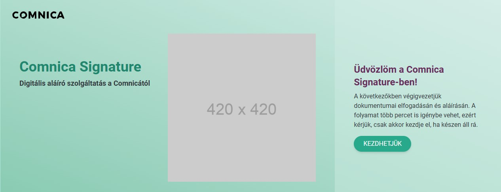

# Comnica

## Table of contents
* [General info](#general-info)
* [Description](#description)
* [Screenshot](#screenshot)
* [Technologies](#technologies)
* [Setup & Start](#setup)
* [State](#state)
* [Routes](#routes)
* [To Test](#to-test)
* [Directory Structure](#directory-structure)
* [Documentation](#documentation)
* [Deploy](#deploy)
* [Created](#created)
* [License](#license)

## General info <a id="general-info"></a>

Test tasks for Comnica

## Description <a id="description"></a>

JavaScript fetchdata.js and React test assignment for Comnica

## Screenshot <a id="screenshot"></a>



## Technologies <a id="technologies"></a>

* Node.js - version 14.x or higher
* React - Frontend Library
* Vite.js - Build tool
* Tailwind CSS - Styling
* MUI - React component Library
* Cypress - End-to-End testing framework for responsive design

## Setup & Start <a id="setup"></a>

* Clone or download the repository:

    ```sh
    git clone https://github.com/ivorszaniszlo/comnica-test.git
    ```

* Navigate to the project directory:

    ```sh
    cd comnica
    ```

* Install the required dependencies:

    ```sh
    npm install
    ```

* Start the development server:

    ```sh
    npm run dev
    ```

* Open the app in your browser at:

    ```plaintext
    http://localhost:5173
    ```

## State <a id="state"></a>

The application's state is managed with React's `useState` hooks.

## Routes <a id="routes"></a>

- `/` – Main page

## To Test <a id="to-test"></a>

Cypress is used for automated responsive testing. The tests simulate different screen sizes, such as mobile and desktop views, to ensure the application is properly responsive.

### Run Cypress tests:

1. Install Cypress:

    ```sh
    npm install cypress --save-dev
    ```

2. Open Cypress interactive mode:

    ```sh
    npx cypress open
    ```

3. Cypress will open a test interface. Select the **responsive.cy.js** test file located in the **`cypress/e2e/`** folder to test the responsiveness of the application.

4. Alternatively, to run Cypress tests in headless mode, use:

    ```sh
    npx cypress run
    ```

## Directory Structure <a id="directory-structure"></a>

```plaintext
/comnica
├── cypress
│   ├── e2e
│   │   └── responsive.cy.js         # Cypress tests for responsive design
│   ├── fixtures
│   ├── support
├── public
│   ├── favicon.ico
│   └── index.html
├── src
│   ├── assets
│   │   └── SVG files...
│   ├── components
│   │   ├──
│   ├── App.jsx
│   ├── index.css
│   └── main.jsx
├── fetchdata.js
├── doc
│   ├── specification.md         # Project specifications in Hungarian
├── package.json
├── README.md
├── eslint.config.mjs
└── vite.config.js

```

## Documentation <a id="documentation"></a>

## Deploy <a id="deploy"></a>

You can deploy this application using **Surge**:

* Install Surge globally:

    ```sh
    npm install --global surge
    ```

* Build the project for production:

    ```sh
    npm run build
    ```

* Deploy the build folder:

    ```sh
    surge ./dist
    ```

* Check out Surge's [documentation](https://surge.sh/) for more details.

* Deployed on [ivor-weather-forecast.surge.sh](https://ivor-comnica.surge.sh/)

## Created <a id="created"></a>

2024

## License <a id="license"></a>

Copyright @ all rights reserved: Szaniszló Ivor
